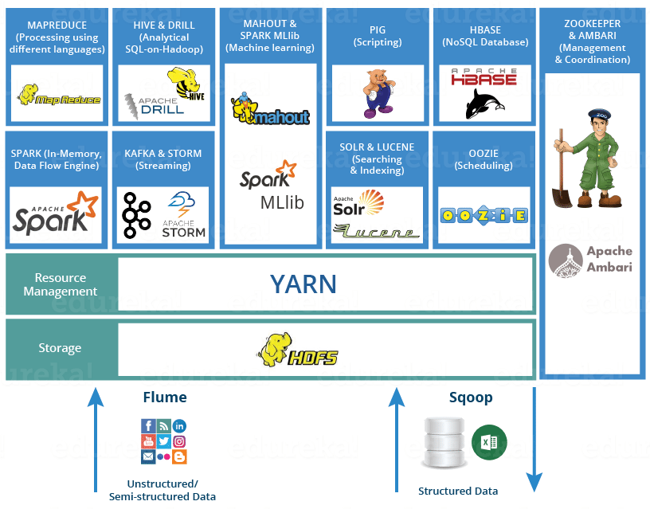

# Apache Hadoop
Framework open source, projetado para processar grandes volumes de dados de forma distribuida, permite que aplicações sejam executadas em clusvers, escalando horizontamente (aumento de nós do cluester).

## Ecosistema Hadoop
Inclui diversas ferramentas/tecnologias para faciliar o armazenamento, processamento, consulta e análise de Big Data.

1. [Hadoop Distributed File System (HDFS)](./ecosistema_hadoop/hdfs.md)
2. [MapReduce](./ecosistema_hadoop/map-reduce.md)