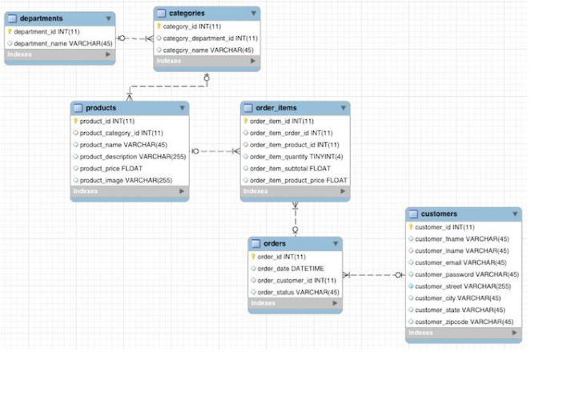
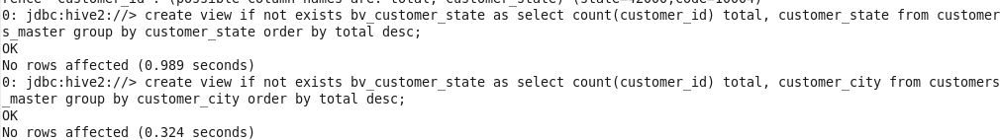

# Implementação de um Data Lake com arquitetura Lambda
Implementar um Data Lake utilizando a arquitetura lambda, desenvolver pipelines de dados em batch e streaming para popular as camadas do lake (batch, speed e serving layer).


## Ferramentas e Tecnologias
Principais ferramentas e tecnologias que serão utilizadas:
- Cloudera VM (Máquina virtual com a tecnologias já instaladas)
- Hadoop
- Hive
- Sqoop
- MySQL

## Banco de Dados (MySQL)
O banco de dados utilizado para o projeto é o "retail_db", um banco de dados pré-instalado na VM utilizada.



## Preparando Ambiente

1. Utilizei o Oracle VirtualBox para abrir uma VM utilizando [Cloudera Quick Start VM](https://community.cloudera.com/t5/Support-Questions/Cloudera-QuickStart-VM-Download/m-p/290587).


- Todas as tecnologias e ferramentas que foram utilizadas no projeto já estão previamente instaladas na VM utilizada.

## Desenvolvimento

### Criando JOB do SQOOP para Batch Layer

1. Iniciei o desenvolvimento fazendo a conexão com o DB MySQL já instalado ná VM e o banco de dados que vou utlizar:

```
$ mysql --user=root --password=cloudera
$ use retail_db
$ show tables;

```


2. Já conectado com o MySQL e testado os banco de dados, abri outro terminal e fiz a conexão com o banco de dados usando o sqoop e importei a tabela que irei utilizar como base para o desenvolvimento (customers).

```
$ sqoop import --connect jdbc:mysql://localhost/retail_db --table customers --username root --password cloudera --check-column customer_id --incremental append --last-value 0 -m 1
```


3. Como não defini nenhum diretório em especifico no HDFS, a tabela importada usando sqoop foi para o diretório padrão do HDFS "/user/[nomeUsuario]"


4. Como o sqoop e o MySQL já foram testados, apagei a tabela física criada no diretório do HDFS /user/cloudera para que eu posso criar o job do sqoop.

```
sudo hdfs dfs -rm -r /user/cloudera
```

5. Utilizando como base o código já testado de importação da tabela customers, criei o job sqoop responsável por essa tarefa.

```
$ sqoop job -D sqoop.metastore.client.record.password=true --create batchlayer -- import --connect jdbc:mysql://localhost/retail_db --table customers --username root --password cloudera --check-column customer_id --incremental append --last-value 0 -m 1
```

- -D sqoop.metastore.client.record.password=true: armazena a senha da conexão com o DB no JOB (não é apropriado para ambientes reais).
- --create batchlayer: nome do job

```
## Visualizar jobs existentes: 
$ sqoop job --list

## Executar job
$ sqoop job --exec batchlayer
```


### Criando a tabela Master e Batch Views no Hive

1. Fiz a conexão com o Hive utilizando a ferramenta já instalada (beeline)

```
$ beeline
$ !connect jdbc:hive2://
```


2. O Hive possui engines para processamentos de dados, o mais utilizado é o MapReduce, que utiliza o próprio MapReduce para as consultas, porém esse é uma engine apropriada para um cluster com diversos NÓS, como estou trabalhando com somente um nó, configurei para o hive ser mais performático com um nó.

```
## Visualizar a configuração atual
set hive.execution.engine;

## Alterando a configuração do Hive
set hive.execution.engine=spark;
```


3. Para começar, criei o banco de dados responsável por armazenar a tabela customers que importei paro HDFS.

```
$ create database customers;
$ use customers;
```

4. Criei a tabela customers dentro do Hive possuindo as mesmas colunas da tabela original do DB MySQL, além da sintaxe padrão do HiveSQL, precisei passar a forma do arquivo físico da tabela e o local no HDFS.

```
$ create table customers_master(customer_id int, customer_fname string, customer_lname string, customer_email string, customer_password string, customer_street string, customer_city string, customer_state, customer_zipcode string) row format delimited fields terminated by ',' location '/user/cloudera/customers';
```


- Criei essa tabela de forma manual, porém é possível facilitar a criação de tabelas no hive utilizando o beeline por exemplo, o próprio sqoop, ou até a criação de scripts para a criação de tabelas.
- As tabelas dentro do hive refletem as tabelas no HDFS, ou seja, qualquer mudança nos registros das tabelas será automaticamente refletido nas tabelas do Hive.

5. Para criar as batch views com as devidas transformações de dados, utilizei a linguage HiveSQL, que é bastante semelhante a linguagem SQL do MySQL.
```
$ create view if not exists bv_customer_state as select count(customer_id) total, customer_state from customers_master group by customer_state order by total desc;

$ create view if not exists bv_customer_state as select count(customer_id) total, customer_city from customers_master group by customer_city order by total desc;
```



### Criando JOB do SQOOP para Speed Layer

1. Da mesma forma da camada Batch Layer, iniciei com a criação do JOB no SQOOP para a transferência de dados do MySQL para o HDFS.

```
sqoop job -D sqoop.metastore.client.record.password=true --create batchlayer -- import --connect jdbc:mysql://localhost/retail_db --table customers --username root --password cloudera --check-column customer_id --incremental append --last-value 12436 -m 1 --target-dir /user/cloudera/customerspeed/
```

- --last-value 12436: defini o ultimo id registrado no processamento em lote
- --target-dir /user/cloudera/customerspeed/: defini um local diferente para o armazenamento da tabela


### Criando as Real-Time Views no Hive

1. Iniciei criando a tabela que vou utilizar como base para a criação das views de real-time, utilizando como base o mesmo código HiveSQL utilizado para criar a tabela-master, alterando o nome e o local ta tabela.

```
create table customers_sl(customer_id int, customer_fname string, customer_lname string, customer_email string, customer_password string, customer_street string, customer_city string, customer_state, customer_zipcode string) row format delimited fields terminated by ',' location '/user/cloudera/customerspeed/';
```

2. Fiz o teste para verificar a criação da tabela no hive, e depois criei as views responsável pelo processamento dos dados da mesma forma das views de batch.

```
$ create view if no exists customer_state_rtv as select count(customer_id) total, customer_state from customers_sl group by customer_state order by total desc;

$ create view if no exists customer_city_rtv as select count(customer_id) total, customer_city from customers_sl group by customer_city order by total desc;
```

3. Com as duas vies finalizadas, foi finalizada as duas primeiras camadas do data lake lambda (batch e speed layer).


### Criando a view para a camada Serving Layer

1. Agora, começando a implementação da camada serving layer, fiz select com o Union das duas views criadas anteriormente nas outras camada para agrupar os resultados e ter a view de consumo.

```
select sum(total), customer_state from (select total, customer_state from bv_customer_state union all select total, customer_state from customer_state_rtv) q1 group by customer_state sort by total desc;
```

2. Com esse script consegui validar as informações vindas das duas camadas, garantindo que a transformação dos dados está correta.
3. Da mesma forma, criei a view utilizando o SELECT criado.

### Criando script para batch layer

1. Agora escreci o script bash responsável por automatizar tudo que fiz até agora em relação a camada batch, considerando a lógica do last-value, ou seja, o script é responsável por iniciar o JOB trás os dados do mysql para a batch layer e remove os atuais dados da camada speed.

```
#!/bin/bash

sudo hdfs dfs -rm -r /user/cloudera/customerspeed/

sqoop job --exec batchlayer

var=$(mysql --user=root --password=cloudera retail_db -s -e "select max(customer_id) from customers;")

sqoop job --delete speedlayer

sqoop job -D sqoop.metastore.client.record.password=true --create batchlayer -- import --connect jdbc:mysql://localhost/retail_db --table customers --username root --password cloudera --check-column customer_id --incremental append --last-value 12436 -m 1 --target-dir /user/cloudera/customerspeed/
```

- #!/bin/bash: indica que o script deve ser executado usando o interpretador Bash.
- sudo hdfs dfs -rm -r: apaga tudo que esta no diretório definido
- var=$(...): adiciona em uma variável de ambiente(var) o maior customer_id da tabela no mysql.

2. No código ajustei o parametro last-valeu para receber sempre o valor da variável var anteriormente no script.
3. Salvei o arquivo.

### Criando script para speed layer

1. Da mesma forma para a camada speed layer, fiz o script responsável por automatizar a execução dos do fluxo dos dados.

```
#!/bin/bash

sqoop job --exec speedlayer
```
2. Salvei o arquivo.
3. Precisei conceder permissão para o sistema executar scripts bash que criei anteriormente, fui para a home da VM, e executei os seguintes comandos:

```
chmod 755 batch
chmod 755 speed
```

### Agendamento com Cron

1. Para automatizar a execução dos scripts para a trasnferência de dados, utilizei o próprio recurso do linux, o Cron, que posso definir intervalos para execução durante um determinado período.
2. Criei mais um arquivo com o seguinte script:

```
* * * * * /home/cloudera/speed
5 0 * * * /home/cloudera/batch
```


3. Abri o terminal na home, e defini a inicialização do script cron

```
# Visualizar agendamentos ativos
$ crontab -l

# Ativando o script cron criado anteriormente
$ crontab /home/cloudera/cron
```

---