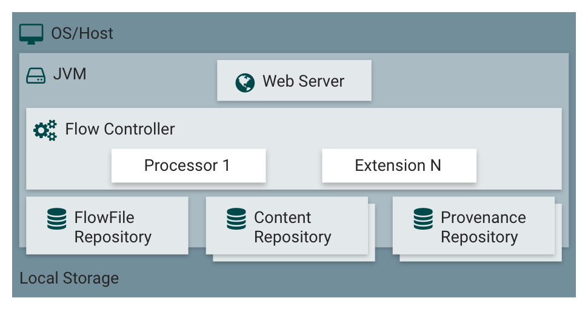

# Arquitetura Apache NiFi

Todos os fluxos desenvolvidos na plataforma são executados pela JVM, dentro de um servidor web, os fluxos são desenvolvidos utilizando extensões nativas ou instaladas do NiFi.

O NiFi possui repositórios para armazenar as operações desenvolvidas, configurações e os próprios dados em transição.

## Componentes
**Servidor Web:**
Um dos principais componentes, local onde monitoramos eventos dentro da plataforma.
**Controle Fluxo:**
Componente que gerencia todos os recursos e processos executados no NiFi, além de controlar o funcionamento das extensões.
**Extensões:**
Plugins que permitem a ligação e iteração entre diferentes sistemas.
**Repositórios:**
Armazenamento de dados que fluem durante a execução de um fluxo de dados.
## FlowFile
Representa os dados reais que estão sendo processados, como arquivos JSON, CSV...
- Armazenado em um repositório gerenciado pelo Nifi.
- Possuem atributos que ajudam a controlar o fluxo de operações aplicadas naqueles dados.
## Processador
Módulo do Java responsável por executar as tarefas dentro do NiFi.
## Fluxo
Utilizado para conectar processadores.
## Conexão
Link entre processadores, funcionando como uma fila.
## Grupo de processos
Conjundo de fluxos, utilizado para facilitar e organizar os processos dentro do NiFi.

---
**[Voltar](../apache-nifi.md)**