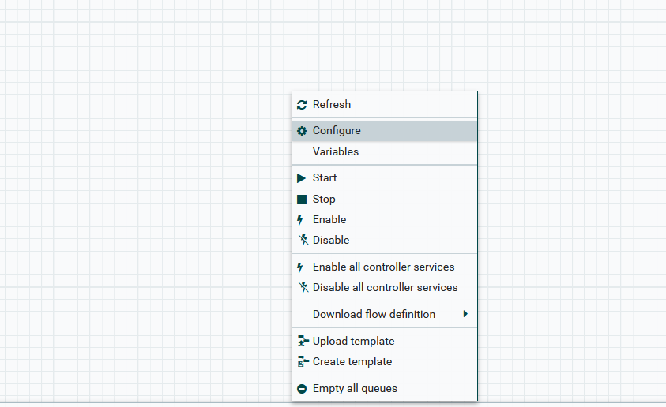
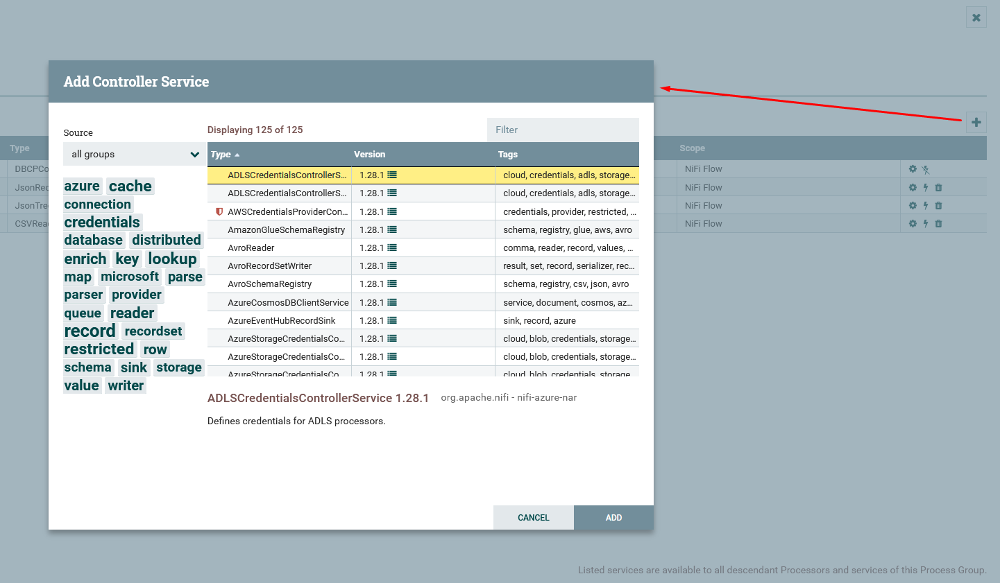
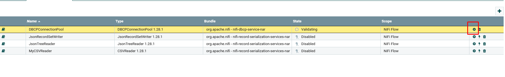
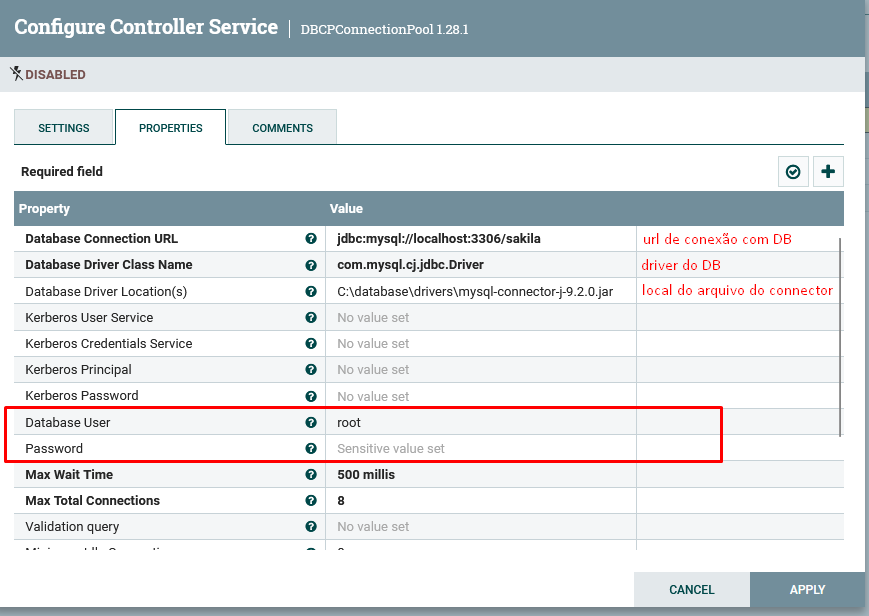

# Controller Service

Componente que fornece funcionalidades compartilhadas e reutilizáveis entre processadores, sendo usado para conexões com DB, configuração de cache, gerenciamento de credenciais, configurações de segurança, controle de ambiente, entre outros.
- **Compartilhamento de recursos:** permite diferentes processadores utilizarem os mesmo recursos evitando redundãncia.
- **Configuração centralizada:** permite que configurações de recursos sejam configuradas em um único local.
## Exemplos

- **DBCPConnectionPool:** Gerencia conexões com bancos de dados, permitindo que processadores como ExecuteSQL, PutSQL, entre outros, reutilizem a mesma conexão sem precisar reconfigurá-la.
- **StandardSSLContextService:** Proporciona serviços de criptografia e SSL que podem ser utilizados por processadores que requerem segurança de comunicação, como GetHTTP ou PutHTTP.
- **HDFS:** Permite a configuração e gestão de conexões com o Hadoop Distributed File System (HDFS) para leitura e escrita de arquivos.

## Como Utilizar
1. Dentro de um espaço em branco do Apache Nifi, clique com o botão direito e acesse "configurações", e depois a aba "Controller Services".

2. Clique no botão de + dentro e defina qual tipo de controller service você irá criar (igual a criação de um processor).

### Configurando uma conexão com DB
3. Para configurar uma controller service para conexão com um DB, crie um controller service do tipo **DBCPConnectionPool**, e clique no icone de configuração para definir a conexão.

4. Por fim defina as configurações de conexão com o banco de dados.

---
**[Voltar](./componentes.md)**