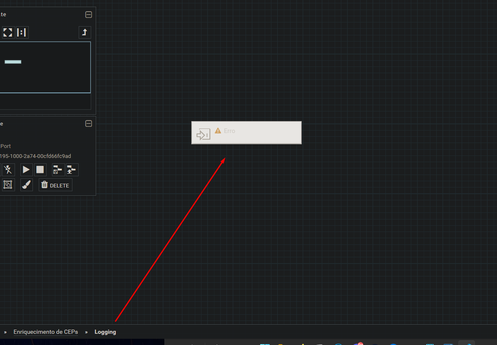

# Trabalhando com APIs e DB Relacional
1. Iniciei criando um processor group como boas práticas para isolar todo o fluxo de dados.

2. Iniciei o desenvolvimento criando os [Controller Services](../componentes/controller-service.md):

- **JsonTreeReader**: Responsável por converter o resultado da query SQL em e response da API em JSON.
- **JsonRecordSetWriter**: Responsável por escrever documentos JSON.

    - Para esses dois controlers não há necessidade de nenhuma configuração.

- **DBCPConnectionPool**: Responsável pela conexão do DB MySQL.

3. Com todos os Controller Services pronto, iniciei o desenvolvimento do fluxo, criei o primeiro processor ExecuteSQLRecord, que será responsável pela consulta inicial a tabela do DB.

4. No mesmo processor defini mais uma propriedade: "Max Rows Per Flow File" = 1, que me possibilita definir a quantidade registros retornados por flowfile (no máximo).
- Ou seja, 1 flowfile para cada linha retornada na query.
5. O próximo passo foi atribuir o valor retornado pela query nos atributos do flowfile, para que me possibilite trabalhar diretamente com os dados retornados.
6. Para isso adicionei um processor EvaluateJsonPath com as seguintes configurações.

8. Agora vou adicionei o processor InvokeHTTP responsável pela requisição para a API

Conexões do processor de requisição da API:

9. Com os dados da API coletados, adicionei o processor PutDatabaseRecord, responsável por inserir dados na tabela do banco de dados.

10. Para melhorar o fluxo de dados já funcional, implementei um fluxo que será responsável pelos erros de execução, primeiramente adicionei dois processors UpdateAttribute para adicionar o atributo "level" (DATABASE E REQUEST) nos flowfiles de erro.

11. Criei um processor grup somente para fazer o processamento dos logs, criei uma entrada para receber os flowfile de erro.

12. De inicio configurei um UpdateAttribute para definir o nome do arquivo e adicionar um timestamp.

13. Parar criar o arquivo que será escrito, adicionei um processor ReplaceText, que irá escrever o log atual.

14. Fiz o merge do arquivo de log com o novo registro inserido, e escrevi o arquivo de log.

---
**[Voltar](./fluxo-dados.md)**