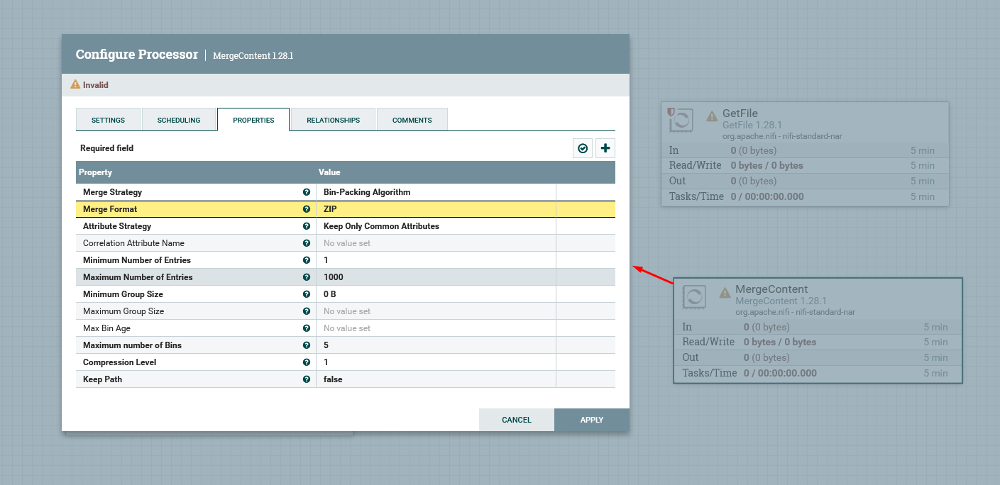

# Compactando arquivos
Para fazer a compressão dos arquivos, utilizei dois processors diferentes.
1. Primeiro criei um fluxo simples isolado para levar os arquivos da origem até o destino.

2. Depois criei mais um processor GetFile para pegar os arquivos da pasta destino.
3. Criei um processor do tipo MergeContent, responsável por juntar todos os arquivos obtidos anteriormente em um uníco arquivo .zip.

4. Após fazer a junção dos arquivos, criei o processor CompressContent, que será responsável por compatar o arquivo.
5. Com o processor para compactação do arquivo já configurado, adicionei mais um processor UpdateAttribute, que atualizará o nome do arquivo compactado.

5. Criei a ligação entre o compress e o update atribute, e depois adicionei mais um compressor para inserir os arquivos em uma pasta de destino chamada "compress".

---
**[Voltar](./fluxo-dados.md)**