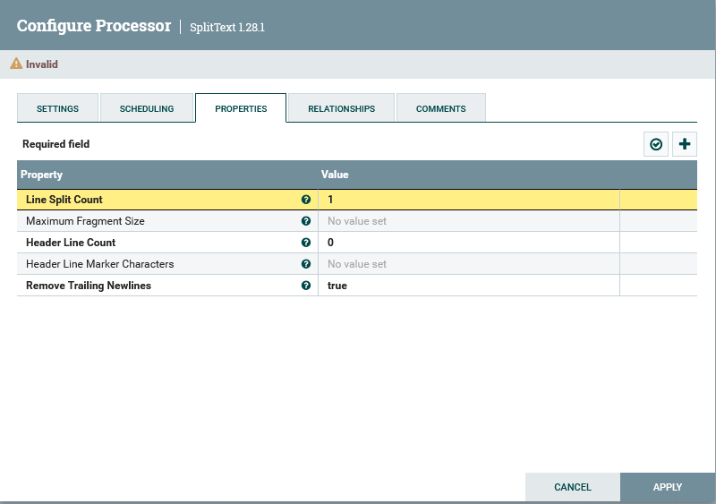
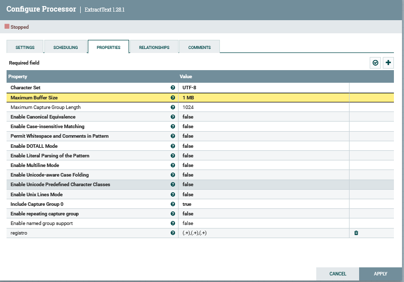
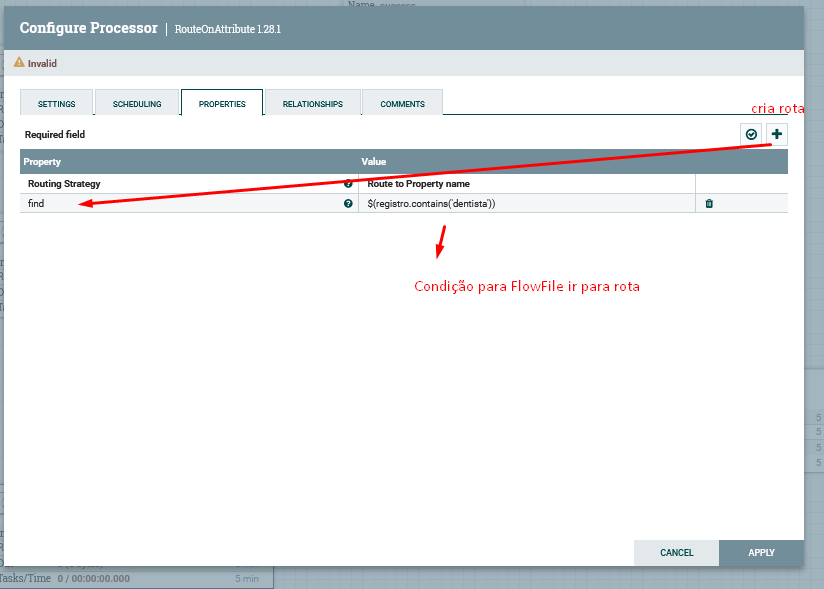
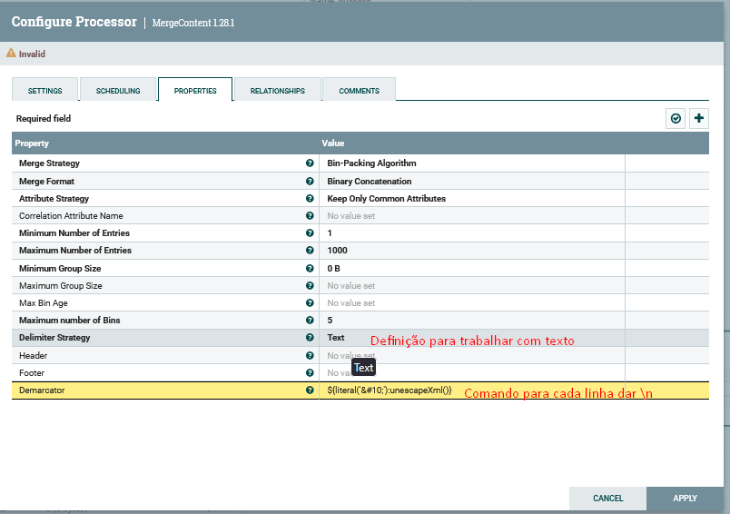
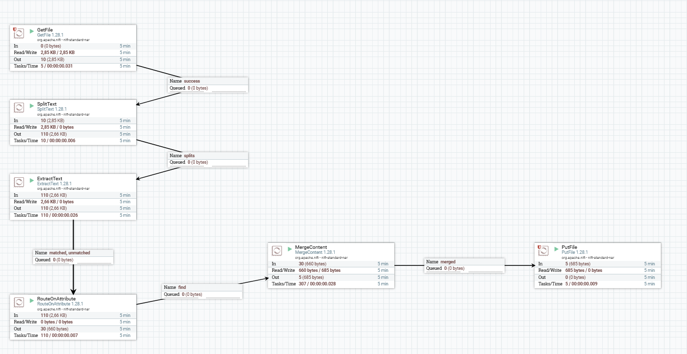

# Filtrando conjunto de Dados(FlowFile)
1. Criei um processor GetFile para obter os dados de um diretório especifico, além da configuração do diretório, defini a propriedade "Keep Source File" = True, para que o arquivo continue no local de origem.
2. Fiz a conexão com um novo processor SplitText, responsável por dividir o FlowFile em linhas, no caso, defini para que ele leia 1 linha por vez.

3. Adicionei mais um processor ExtractText, responsável por dividir cada item da linha em registros, utilizando uma expressão regular. 

4. Após isso criei outro processor do tipo RouteOnAttribute, que é utilizado como roteador, encaminhando cada FlowFile para rotas diferentes no fluxo de acordo com uma **Expressão regular NiFi**.

5. Agora, criando o fluxo caso entre na rota "find" definida anteriormente, adicionei um processor MergeContent, que irá juntar os registros que separei anteriormente para filtro.
- ${literal('&#10;'):unescapeXml()}

6. E por fim, adicionei mais um processor para inserir o arquivo filtrado dentro de um diretório.

---
**[Voltar](./fluxo-dados.md)**