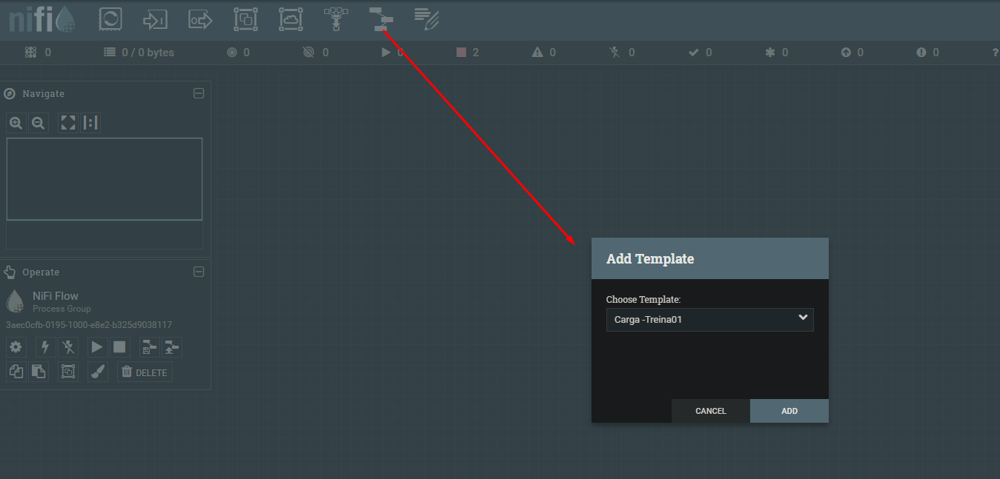
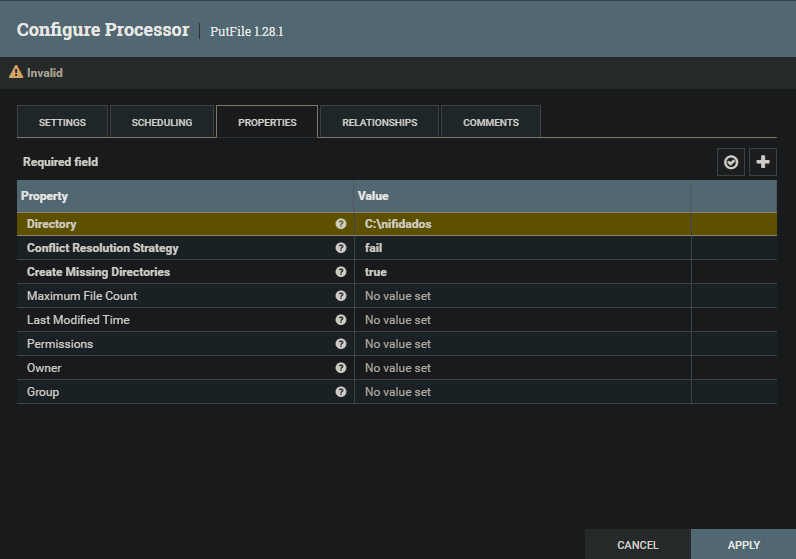
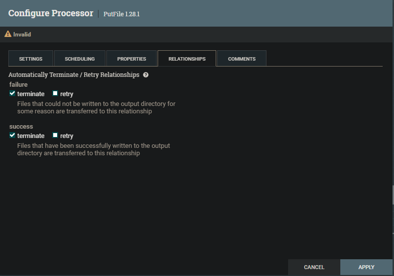
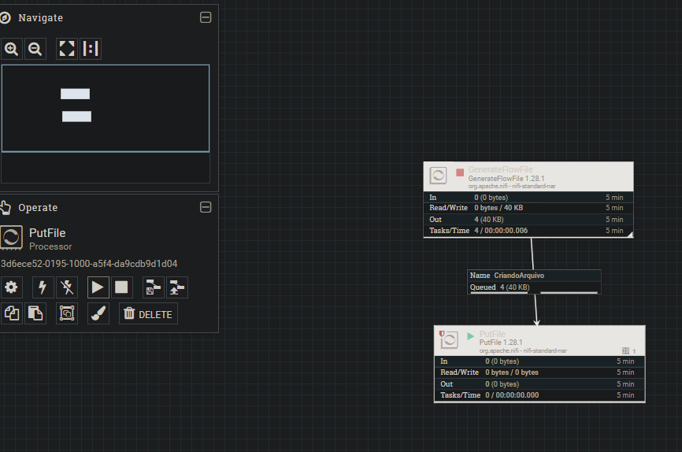

# Salvando Arquivos de Dados
1. Aqui vou utilizar como inicio do desenvolvimento, o fluxo de dados já desenvolvido anteriormente, fiz o upload do template criado anteriormente, e adicionei fluxo de dados que vou desenvolver.

2. Para criar os arquivos de dados, vou utlizar um processor do tipo "PutProcessor":

3. Fiz a conexão entre os dois processos criados, e executei o fluxo.

---
**[Voltar](fluxo-dados.md)**