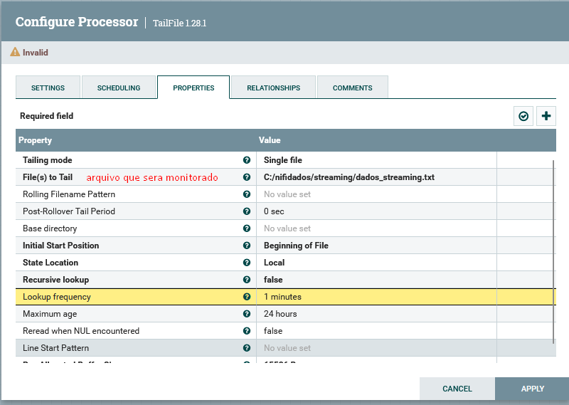
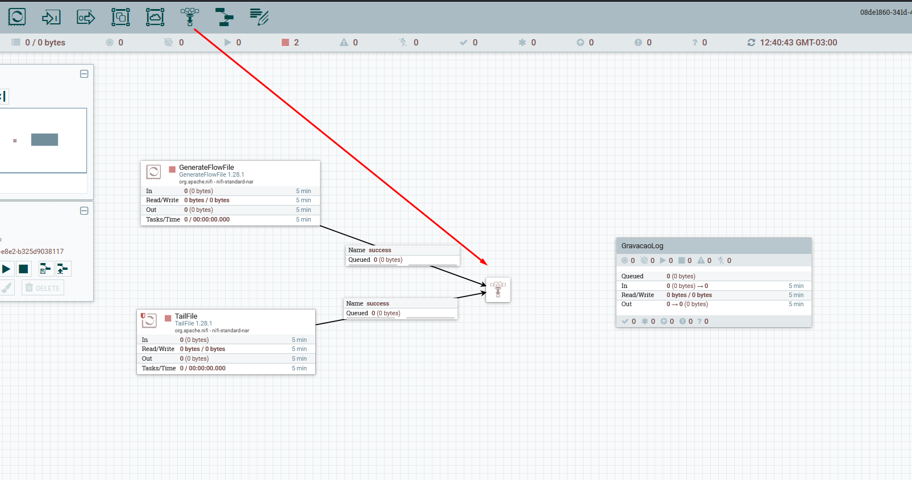
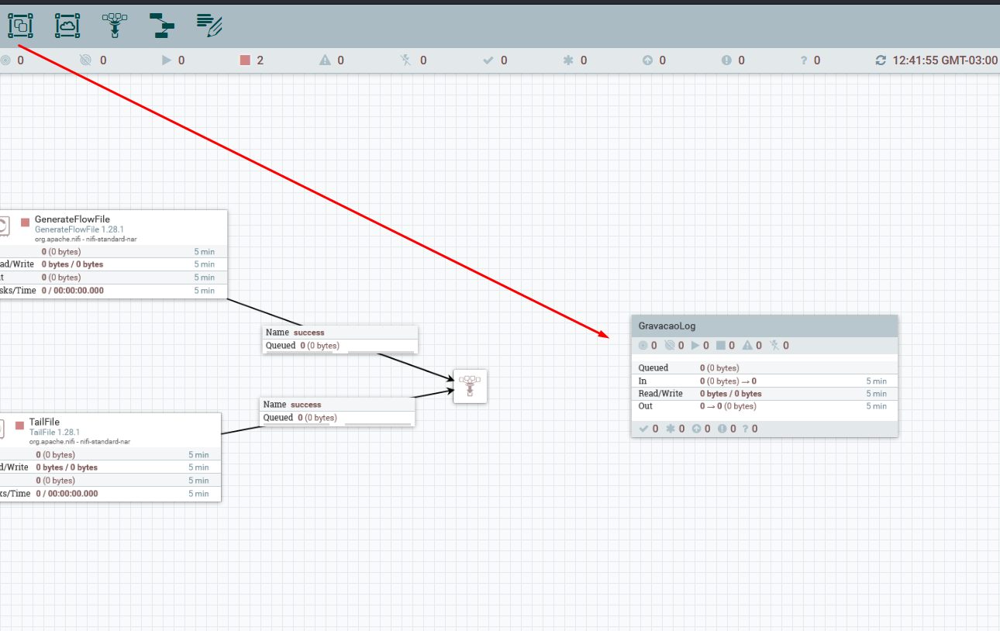
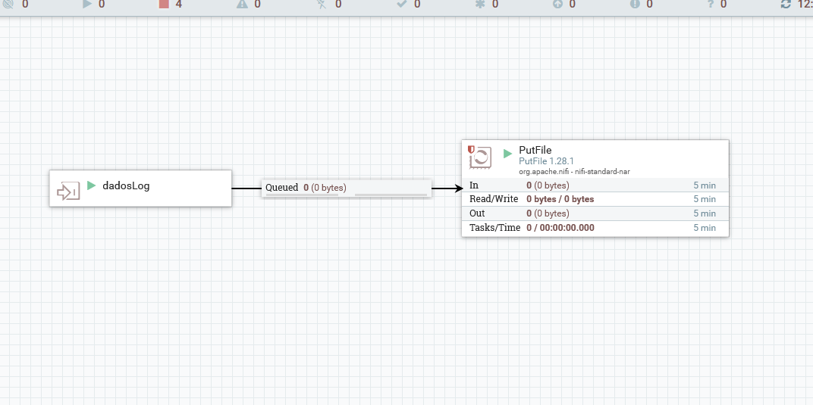
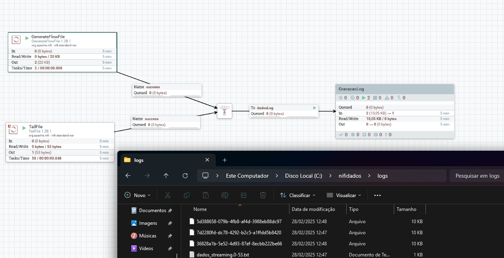

# Interligando fluxo de dados

1. Iniciei adicionando o primeiro processor TailFile, que a cada 1 segudo irá monitorar em **tempo real** arquivos de log ou outros aquivos de texto.

2. Criei um processor GenerateFlowFile para gerar alguns dados aleatórios em texto para o desenvolvimento desse fluxo.
3. Utilizei o "Funnel" para levar os dados gerados pelos dois processors criados até agora para um grupo de processors que será criado a seguir.

3. Criei um "Processor Group" para criar um grupo de processor responsável por gravar o log do fluxo de dados.

4. Acessei o processor group e defini as portas de entrada para o grupo (como se fosse os parametros para a inicialização do grupo), e configurei um processor PuFile para escrever os arquivos de log.

5. Fiz a ligação do funnel com o grupo criado e executei o processo para gerar logs mock.

---
**[Voltar](./fluxo-dados.md)**