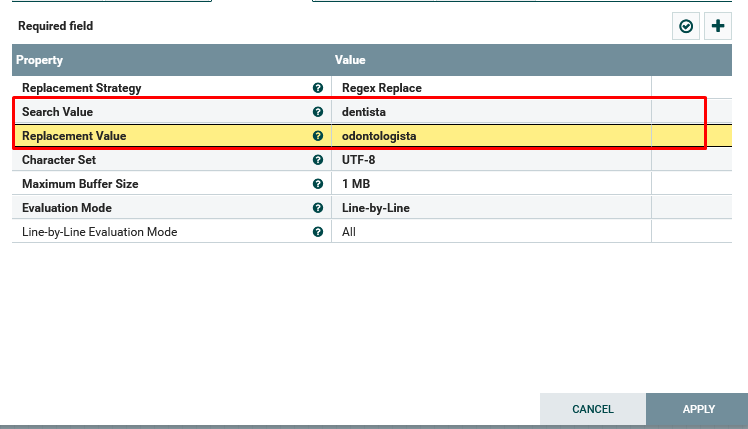
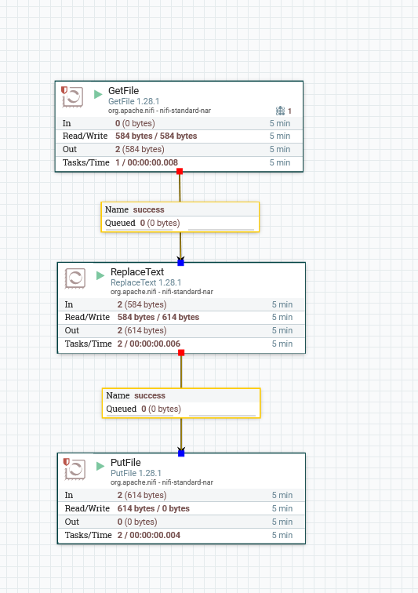

# Manipulando Dados com NiFi
1. Iniciei adicionando o processor responsável por obter os dados do arquivo.
2. Para trabalhar com alteração nos dados existentes de um flowfile, adicionei o processor ReplaceText, com as seguintes configurações.

3. Após isso, adicionei um processor PutFile para salvar o novo arquivo no local de destino e fiz as conexões entre os processors.

---
**[Voltar](./fluxo-dados.md)**