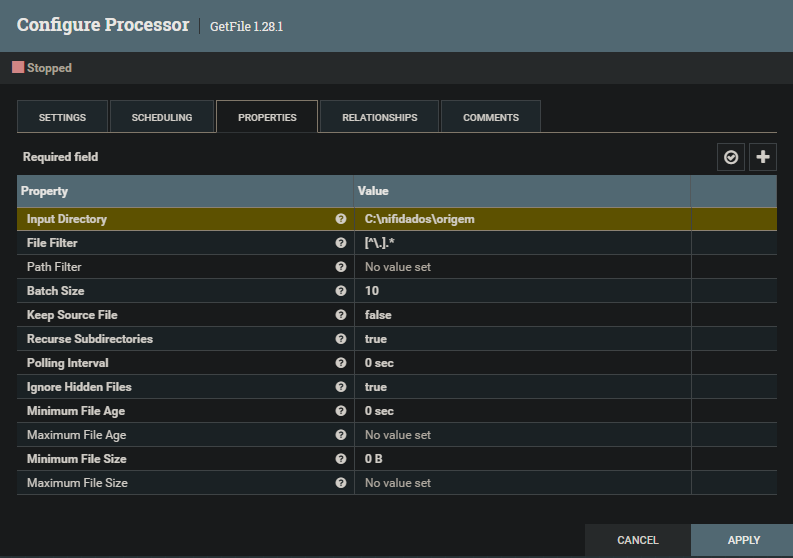

# Movimentando arquivos entre diretórios
1. Iniciei criando um processor do tipo "GetFile", definindo o diretório do arquivo e agendando para a cada 30 segundos.

2. Criei o processor (PutFile) que sera responsável por criar o arquivo em outro diretório e defini o diretório de saída.
3. Criei a conexão entre os dois processors criados e executei o fluxo.

---
**[Voltar](./fluxo-dados.md)**