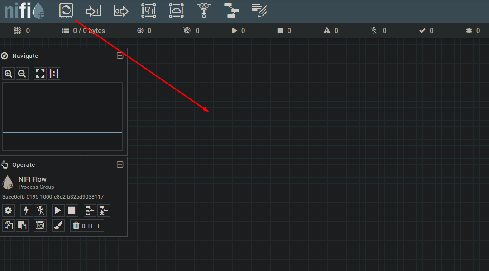
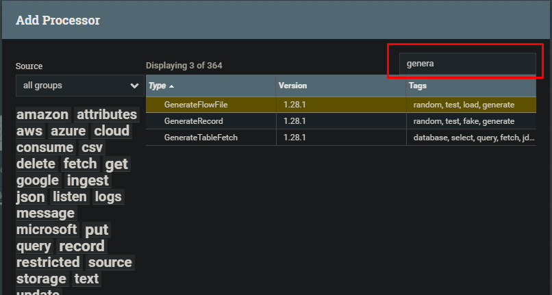
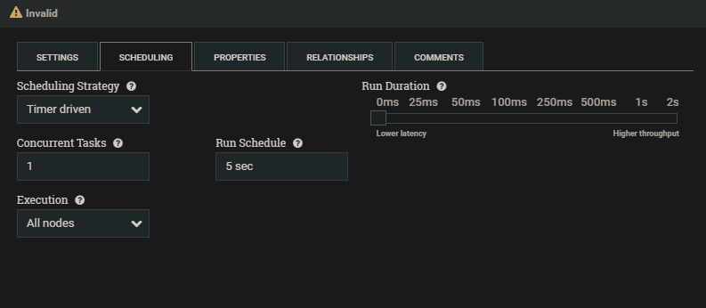
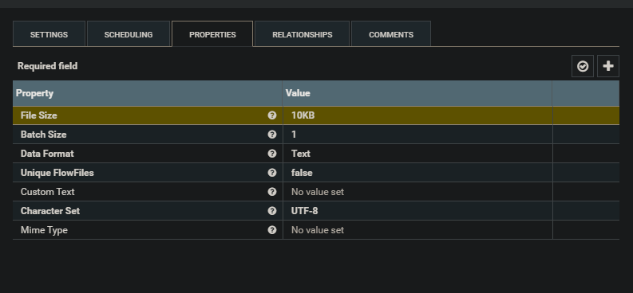
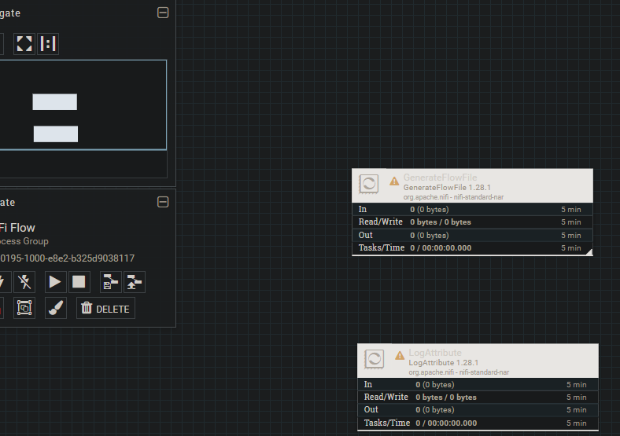
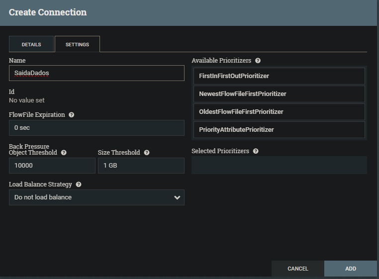
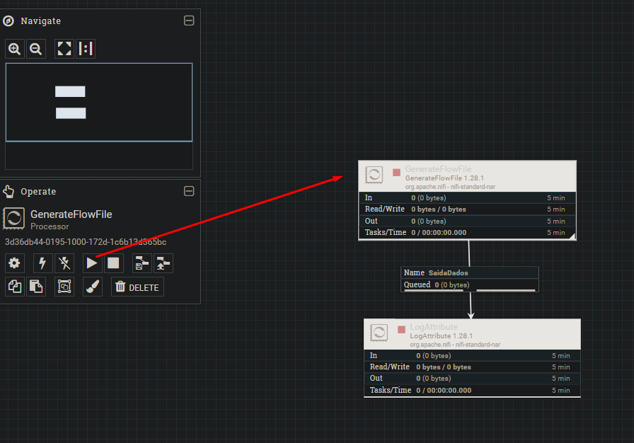

# Fluxo de Dados simples
1. Para iniciar a configuração do processor arrastei e solte o icone do processor para a área de trabalho do NiFi.

2. Existem diversos tipos de processor que pode ser criado, como podemos ver na tela que abriu, porém vou utilizar o "GenerateFlowFile".

3. Acessando o processador criado, defini que acada 5 segundos será gerado um uma quantidade de dados random.

4. Logo configurei as propriedades do flowfile que será gerado, como o tamanho e o formato dos dados.

5. Criei mais um processor para utilizar como log, tendo como tipo "LogAttribute" com as configurações padrões.

6. Após isso criei uma conexão entre os dois processors que criei, definindo o nome como SaidaDados:

7. Após isso executei o fluxo de dados, iniciando o processador responsável por gerar os dados de forma random.

8. Após isso salvei todo o trabalho desenvolvido, cliando em uma área em branco e selecionando "Create template"

---
**[Voltar](./fluxo-dados.md)**