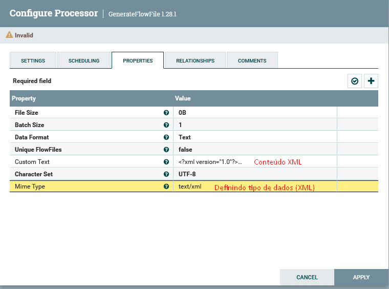
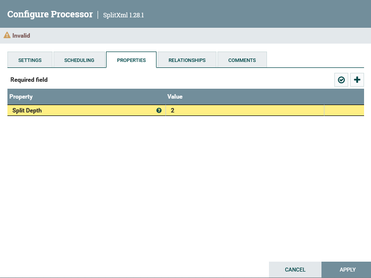
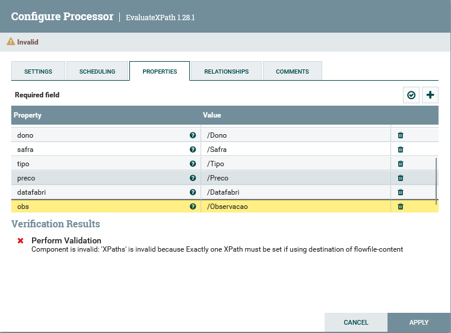
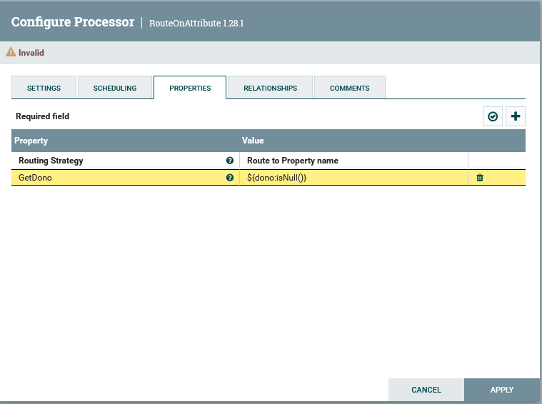
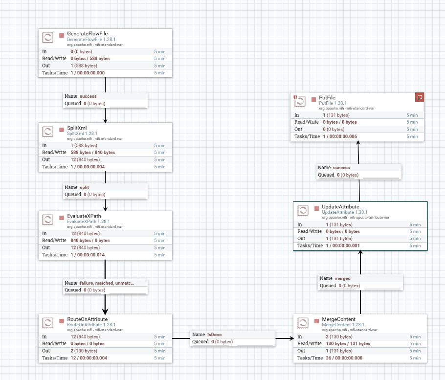

# Trabalhando com XML
1. Inicidei o desenvolvimento do fluxo criando um flowfile de um XML, adicionando um processor GenerateFlowFile para rodar a cada 1 min.

2. Depois adicionei um processor SplitXML, onde consigo obter todas as tags XML a partir do nível de hierarquia da tag que eu definir.

3. Adicionei o processor EvalueteXPath, responsável por obter os campos especificos do XML que estou trabalhando e definir os campos que desejo do meu XML.

4. Adicionei um processor RouteOnAttribute para filtrar somente pelo atributo dono que não for null.

5. Após filtrar todos os Flowfiles que possuem o atributo dono, juntei todos em um único FlowFile usando um processor MergeContent, atualizei o nome do arquivo com UpdateAttribute, e coloquei um PutFile para gerar o arquivo no local de destino.

---
**[Voltar](./fluxo-dados.md)**
